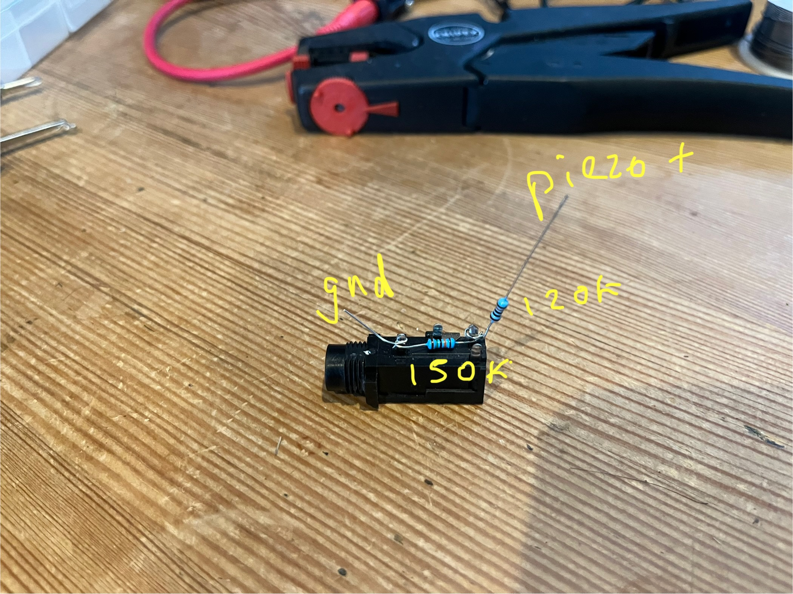
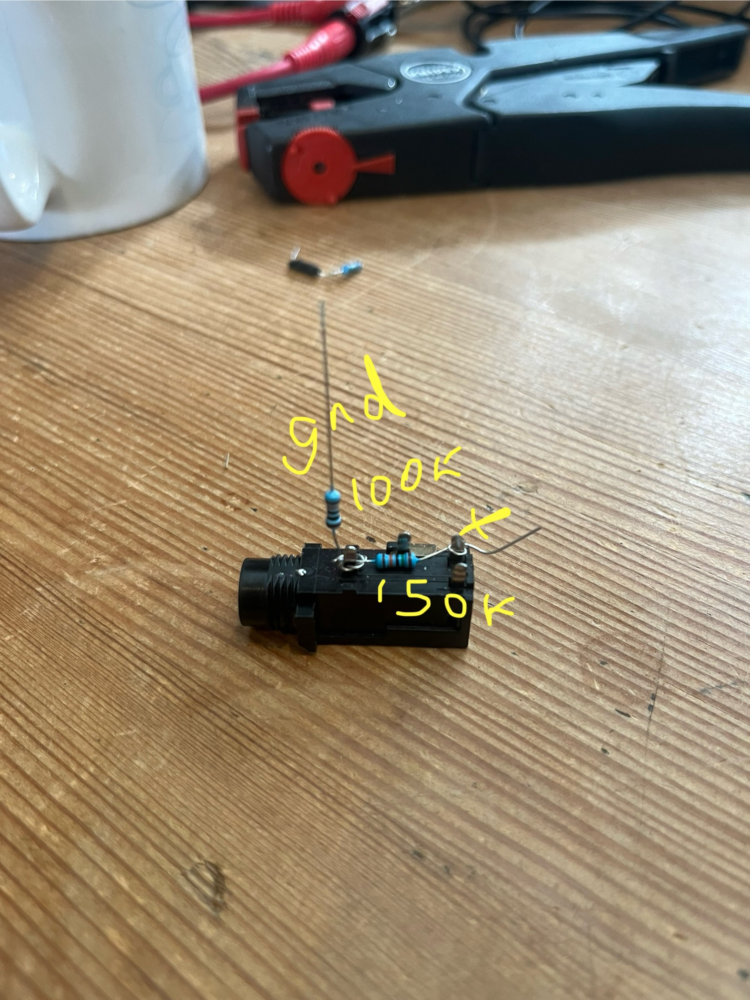

# piezo_signal_conditioner

# OrchLab — Piezo Signal Conditioner

Circuit description · MCP6002 · 3.3V single supply · Teensy 4.0

This is how the standard alesis drum trigger is wired

I have wired it backwards as the first peak was a negative peak and stronger than ther rest and i wanted that sensitivity - so i have wired it like this

## Input

**C (piezo sensor)** is attached to the drum head and generates a voltage spike when struck. **R1 (1MΩ)** pulls the input down to 0V when the drum is idle, preventing the signal line from floating and picking up noise.

## Protection

**R2 (100Ω)** is a series resistor that limits current flowing through the protection diodes during large voltage spikes. **D1 and D2 (1N4148)** clamp the signal to a safe range. If the signal rises above 3.3V, D1 conducts and diverts the excess into the 3.3V rail. If the signal goes below 0V — which the piezo's negative spike will do — D2 conducts and pulls it back to ground. In each case the signal overshoots by the diode forward voltage of approximately 0.7V, giving a safe window of roughly −0.7V to 4V, well within the tolerance of the downstream components.

## Stage 1 — Buffer (U1A)

The protected signal feeds into the non-inverting input of **U1A (MCP6002)**, configured as a unity-gain buffer by connecting its output directly back to its inverting input. The op-amp presents very high impedance at its input, avoiding any loading of the delicate piezo signal, then drives its output from a low impedance. The signal passes through unchanged in level but is now robust enough to drive the next stage without loss.

## Stage 2 — Amplifier (U1B)

**R3 (10kΩ)** connects the buffer output to the non-inverting input of **U1B**. It is primarily a protective measure — in the event of a fault in U1B it prevents anything feeding back into U1A.

U1B is configured as a non-inverting amplifier. The feedback network consists of **R4 (10kΩ)** from the inverting input to ground, and **RV1 (100kΩ trim pot)** from the inverting input to the output. The op-amp continuously adjusts its output to keep its two inputs equal. By varying RV1 the proportion of output fed back changes, controlling the gain. Gain = 1 + (RV1 ÷ R4), giving a range of 1× to 11×. One trim pot per drum allows independent sensitivity matching between the two channels.

## Stage 3 — Peak Detector

**D3 (1N4148)** rectifies the amplified signal, allowing only positive voltages through. **C2 (100nF)** charges to the peak voltage of each strike and holds it. **R5 (265kΩ)** slowly drains C2 to ground, giving a hold time of approximately 10ms (τ = R × C) — comfortably longer than the Teensy's 5ms scan window, ensuring the ADC reads the peak cleanly before it decays.

## Power Supply (U1C)

**U1C** represents the power pins of the MCP6002 package containing U1A and U1B. VCC connects to the 3.3V rail and GND to ground. A **100nF bypass capacitor (C1)** placed directly across the supply pins absorbs rapid current transients and keeps the local supply clean at the IC.