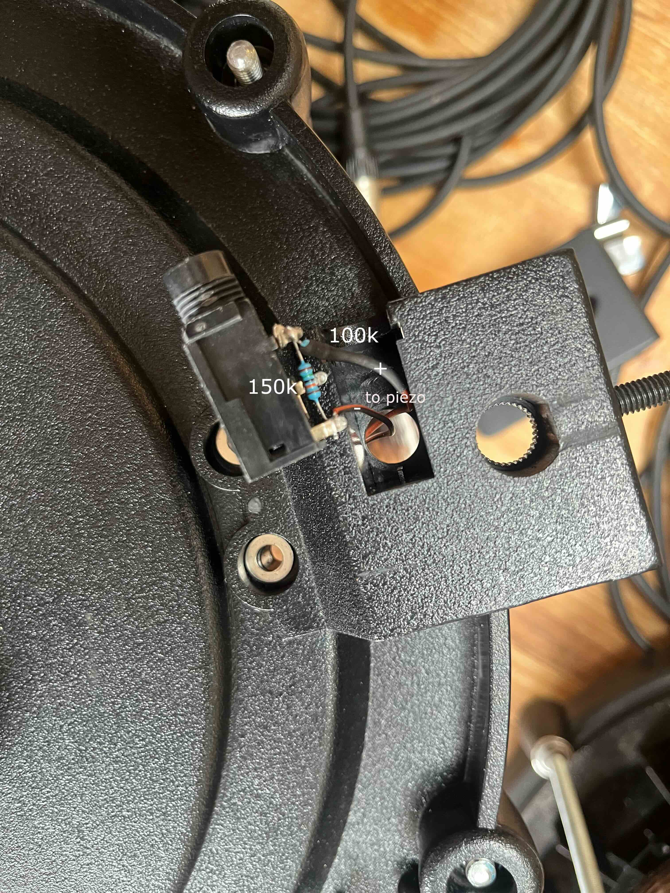
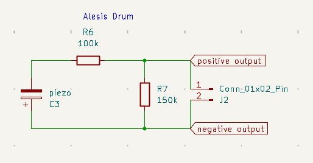
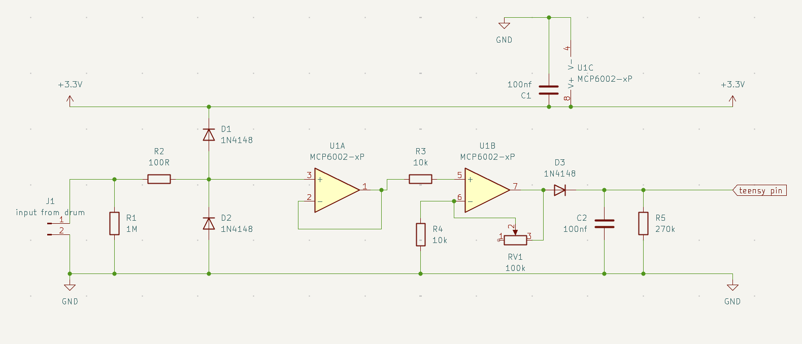
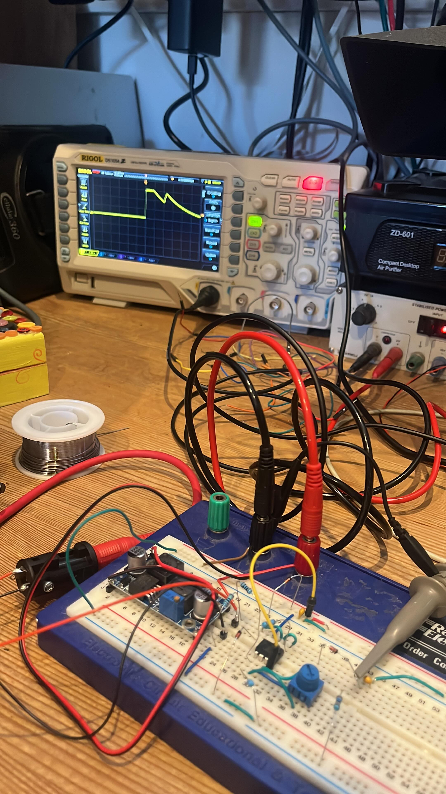
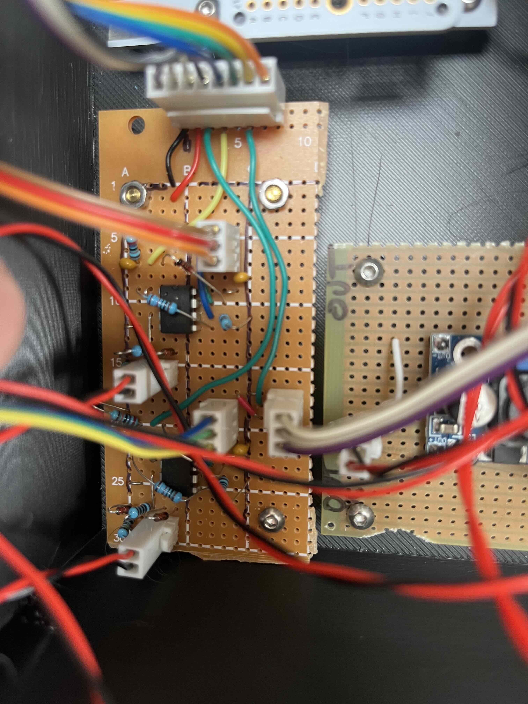

# OrchLab — Piezo Signal Conditioner

A signal conditioning circuit for piezo drum triggers, developed as part of the [OrchLab](https://orchlab.org/) project — a collaboration between the [London Philharmonic Orchestra](https://lpo.org.uk/) and [Drake Music](https://www.drakemusic.org/) to create accessible electronic timpani.

This board takes the raw piezo output from an Alesis mesh head drum pad and conditions it for reliable ADC reading on a Teensy 4.0. One board is used per drum channel. The companion firmware repository is [gawainhewitt/kettledrum](https://github.com/gawainhewitt/kettledrum).

---

## Alesis Pad Wiring

The Alesis pad contains an internal voltage divider — a 100kΩ series resistor and 150kΩ pull-down — which must be retained as it is critical to signal sensitivity.

### Standard wiring

*Standard Alesis internal wiring — positive piezo terminal to output*

### Reversed wiring (used in this project)

The dominant piezo signal is the initial negative spike. To capture this as a positive voltage, the piezo connections inside the drum are swapped — positive terminal to ground, negative terminal to output. This gives a stronger, cleaner peak without any additional inverting circuitry.

*Reversed wiring — negative piezo terminal to output, capturing the dominant spike as a positive signal*

*Internal piezo circuit — note reversed polarity wiring*

---

## Circuit Overview

*Full schematic — one channel shown*

The signal passes through four stages:

### Input

**C3 (piezo sensor)** generates a voltage spike when the drum head is struck. **R1 (1MΩ)** pulls the input to 0V when idle, preventing the signal line from floating and picking up noise.

### Protection

**R2 (100Ω)** limits current through the protection diodes during large voltage spikes. **D1 and D2 (1N4148)** clamp the signal to a safe range — D1 conducts if the signal rises above 3.3V, D2 conducts if it goes below 0V. Each diode has a forward voltage of approximately 0.6V, giving a safe window of roughly −0.6V to 3.9V, well within the tolerance of the downstream components.

### Stage 1 — Buffer (U1A)

The protected signal feeds into the non-inverting input of **U1A (MCP6002)**, configured as a unity-gain buffer. The op-amp presents very high impedance at its input, avoiding any loading of the delicate piezo signal, then drives its output from a low impedance. The signal passes through unchanged in level but is now robust enough to drive the next stage.

### Stage 2 — Amplifier (U1B)

**R3 (10kΩ)** connects the buffer output to the non-inverting input of **U1B**, acting as a protective measure against faults feeding back into U1A.

U1B is configured as a non-inverting amplifier. The feedback network consists of **R4 (10kΩ)** from the inverting input to ground and **RV1 (100kΩ trim pot)** from the inverting input to the output. Gain = 1 + (RV1 ÷ R4), giving a range of 1× to 11×. One trim pot per drum allows independent sensitivity matching between the two channels.

### Stage 3 — Peak Detector

**D3 (1N4148)** rectifies the amplified signal, passing only positive voltages. **C2 (100nF)** charges to the peak voltage of each strike and holds it. **R5 (270kΩ)** slowly drains C2 to ground, giving a hold time of approximately 27ms (τ = R × C) — comfortably longer than the Teensy's 5ms scan window, ensuring the ADC reads the peak cleanly before it decays.

### Power Supply Decoupling (U1C)

**U1C** represents the power pins of the MCP6002 package. A **100nF bypass capacitor (C1)** placed directly across the supply pins absorbs rapid current transients and keeps the local supply clean.

---

## Bill of Materials

*Per channel — double all quantities for a two-drum build.*

| Reference | Component | Value | Notes |
|-----------|-----------|-------|-------|
| C1 | Ceramic capacitor | 100nF | Power supply decoupling |
| C2 | Ceramic capacitor | 100nF | Peak detector hold |
| C3 | Piezo sensor | — | Alesis internal pad piezo |
| D1, D2 | Signal diode | 1N4148 | Input clamp |
| D3 | Signal diode | 1N4148 | Peak detector rectifier |
| R1 | Resistor | 1MΩ | Input pull-down |
| R2 | Resistor | 100Ω | Current limiting |
| R3 | Resistor | 10kΩ | Inter-stage protection |
| R4 | Resistor | 10kΩ | Amplifier feedback |
| R5 | Resistor | 270kΩ | Peak detector drain |
| RV1 | Trim pot | 100kΩ | Sensitivity / gain adjust |
| U1 | Op-amp | MCP6002 | Dual op-amp, 3.3V compatible |
| J1 | Connector | 2-pin | Input from drum |
| J2 | Connector | 3-pin | Output + power to Teensy |

---

## Connections to Teensy 4.0

| Board pin | Teensy pin | Notes |
|-----------|-----------|-------|
| Output (channel 1) | A0 | ADC input, drum 1 |
| Output (channel 2) | A1 | ADC input, drum 2 |
| VCC | 3.3V | From Teensy 3.3V rail |
| GND | GND | Common ground |

---

## Build

### Breadboard verification

The circuit was built and verified stage by stage on breadboard, with oscilloscope checks at each point in the signal chain before proceeding to the next stage.

*Completed breadboard build with oscilloscope showing conditioned output signal*

### Perfboard

Both channels are built onto a single perfboard for the final installation.

*Completed perfboard with both drum channels*

---

## Notes

- The MCP6002 is specified for single-supply operation down to 1.8V and is well suited to 3.3V systems. Rail-to-rail input and output allows the signal to swing close to both supply rails.
- The Alesis internal resistor network (R6 100kΩ series, R7 150kΩ pull-down) must not be removed — it is part of the signal path and removing it significantly degrades sensitivity.
- This circuit was designed to avoid any mid-rail reference or negative supply. The reversed piezo wiring is a simpler and more robust alternative to an inverting amplifier stage.